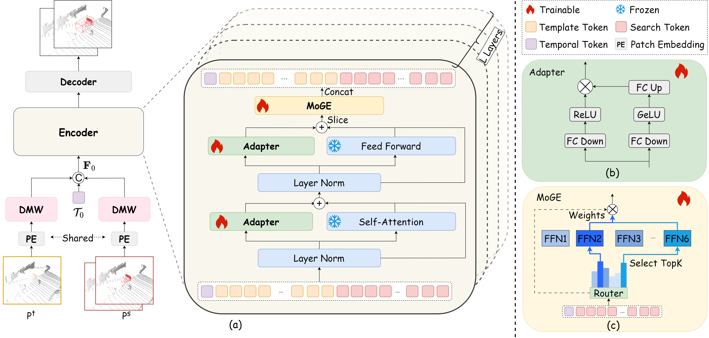

# TrackAny3D: Transferring Pretrained 3D Models for Category-unified 3D Point Cloud Tracking (ICCV2025)

## Introduction
In this project, we propose **TrackAny3D**, the first framework that successfully adapts large-scale pretrained point cloud models to category-agnostic 3D SOT without requiring category-specific fine-tuning. We conduct extensive experiments on widely used datasets including KITTI, nuScenes, and Waymo. Experimental results demonstrate that TrackAny3D achieves state-of-the-art (SOTA) performance under the category-unified setting, while also showing strong generalization across object categories. Our work provides a promising new solution for open-world 3D tracking scenarios.



Please refer to the [Paper](https://arxiv.org/pdf/2507.19908) for more details.

## Setup

### Dependencies

Here we list the most important part of our dependencies

| Dependency        | Version                    |
| ----------------- | -------------------------- |
| open3d            | 0.15.2                     |
| python            | 3.8.0                      |
| pytorch           | 1.8.0(cuda11.1,cudnn8.0.5) |
| pytorch-lightning | 1.5.10                     |
| pytorch3d         | 0.6.2                      |
| shapely           | 1.8.1                      |
| torchvision       | 0.9.0                      |

Others can be seen in [Open3DSOT](https://github.com/Ghostish/Open3DSOT)

### KITTI dataset
+ Download the data for [velodyne](http://www.cvlibs.net/download.php?file=data_tracking_velodyne.zip), [calib](http://www.cvlibs.net/download.php?file=data_tracking_calib.zip) and [label_02](http://www.cvlibs.net/download.php?file=data_tracking_label_2.zip) from [KITTI Tracking](http://www.cvlibs.net/datasets/kitti/eval_tracking.php).
+ Unzip the downloaded files.
+ Put the unzipped files under the same folder as following.
  ```
  [Parent Folder]
  --> [calib]
      --> {0000-0020}.txt
  --> [label_02]
      --> {0000-0020}.txt
  --> [velodyne]
      --> [0000-0020] folders with velodynes .bin files
  ```

### NuScenes dataset
+ Download the dataset from the [download page](https://www.nuscenes.org/download)
+ Extract the downloaded files and make sure you have the following structure:
  ```
  [Parent Folder]
    samples	-	Sensor data for keyframes.
    sweeps	-	Sensor data for intermediate frames.
    maps	        -	Folder for all map files: rasterized .png images and vectorized .json files.
    v1.0-*	-	JSON tables that include all the meta data and annotations. Each split (trainval, test, mini) is provided in a separate folder.
  ```
> Note: We use the **train_track** split to train our model and test it with the **val** split. Both splits are officially provided by NuScenes. During testing, we ignore the sequences where there is no point in the first given bbox.

### Waymo Open Dataset

- We follow the benchmark created by [LiDAR-SOT](https://github.com/TuSimple/LiDAR_SOT) based on the waymo open dataset. You can download and process the waymo dataset as guided by [LiDAR_SOT](https://github.com/TuSimple/LiDAR_SOT), and use our code to test model performance on this benchmark.
- The following processing results are necessary

```
[waymo_sot]
    [benchmark]
        [validation]
            [vehicle]
                bench_list.json
                easy.json
                medium.json
                hard.json
            [pedestrian]
                bench_list.json
                easy.json
                medium.json
                hard.json
    [pc]
        [raw_pc]
            Here are some segment.npz files containing raw point cloud data
    [gt_info]
        Here are some segment.npz files containing tracklet and bbox data
```

## Quick Start
### Training

To train a model, you must specify the `.yaml` file. The `.yaml` file contains all the configurations of the dataset and the model. We provide `.yaml` files under the [configs/](./configs) directory. 

**Note:** Before running the code, you will need to edit the `.yaml` file by setting the `data_root_dir` argument as the correct root of the dataset.

```
python main.py configs/trackany_kitti_car_cfg.yaml --gpus 0 1
```

### Testing

To test a trained model, specify the checkpoint location with `--resume_from` argument and set the `--phase` argument as `test`.


```
python main.py configs/trackany_kitti_car_cfg.yaml --phase test --resume_from pretrained/kitti.ckpt
```

## Citation
If you find TrackAny3D useful, please consider citing: 

@article{wang2025trackany3d,
  title={TrackAny3D: Transferring Pretrained 3D Models for Category-unified 3D Point Cloud Tracking},
  author={Wang, Mengmeng and Wang, Haonan and Li, Yulong and Kong, Xiangjie and Du, Jiaxin and Shen, Guojiang and Xia, Feng},
  journal={Proceedings of the IEEE International Conference on Computer Vision (ICCV)},
  year={2025}
}

## Acknowledgement
This repo is heavily built upon [Open3DSOT](https://github.com/Ghostish/Open3DSOT) , [MBPTrack](https://github.com/slothfulxtx/MBPTrack3D) and [DAPT](https://github.com/LMD0311/DAPT).

